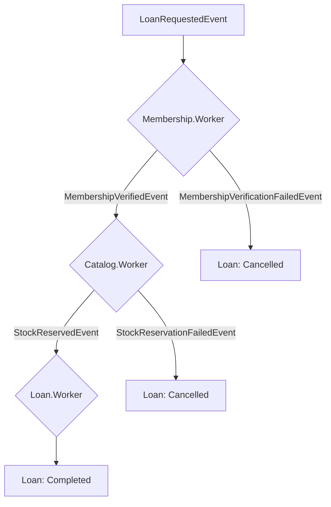
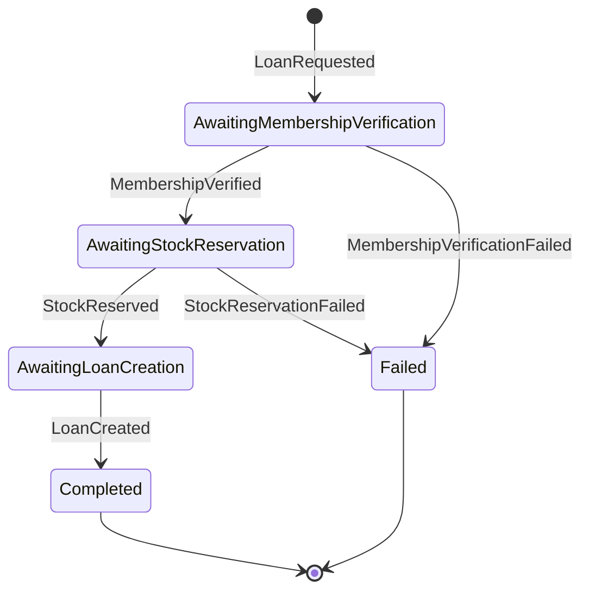

# Library Saga — Choreography vs Orchestration

Saga pattern'in iki temel yaklaşımını (**Choreography** ve **Orchestration**) aynı domain üzerinde sıfırdan implemente ederek karşılaştırmalı olarak öğrenmek amacıyla geliştirilmiş bir proje. .NET 8, MassTransit, RabbitMQ ve Entity Framework Core kullanılarak, aynı iş akışı iki farklı mimari yaklaşımla iki kez inşa edilmiştir.

---

## Senaryo

Bir kütüphane ödünç alma sistemi. Bir üye kitap ödünç almak istediğinde:

1. **Membership** — üyenin uygunluğu kontrol edilir (aktif üyelik, gecikmiş kitap yok).
2. **Catalog** — kitabın stoğu kontrol edilip rezerve edilir.
3. **Loan** — ödünç kaydı oluşturulur.
4. Herhangi bir adımda hata olursa (üye uygun değil, stok yetersiz), süreç **compensation** ile otomatik iptal edilir.

Bu akış, repoda iki farklı klasörde, iki farklı koordinasyon stratejisiyle implemente edilmiştir:

| | `saga-choreography/` | `saga-orchestration/` |
|---|---|---|
| **Koordinasyon** | Merkezi otorite yok, her servis kendi event'ini dinler/yayınlar | Tek bir state machine (`Loan.Orchestrator`) tüm akışı yönetir |
| **İletişim** | Event ("ben oldum bu") | Komut ("sen şunu yap") + Event (sonuç) |
| **Süreç durumu** | Hiçbir yerde tek parça değil, DB'lerden reconstruct edilir | `LoanSagaState` tablosunda tek satırda görünür |
| **RabbitMQ portu** | `5672` | `5673` |
| **SQL Server portu** | `1433` | `1434` |

İki proje birbirinden bağımsız altyapı (RabbitMQ + SQL Server container'ları) kullanır ve **aynı anda paralel çalıştırılabilir.**

---

## Proje Yapısı

```
saga-choreography/
├── Contracts/              # Event tipleri
├── Trigger.Api/             # Saga'yı başlatan tek kapı (POST /api/Loans)
├── Membership.Worker/       # LoanRequestedEvent dinler
├── Catalog.Worker/          # MembershipVerifiedEvent dinler
├── Loan.Worker/             # StockReserved / *Failed event'lerini dinler
└── docker-compose.yml       # RabbitMQ (5672/15672) + SQL Server (1433)

saga-orchestration/
├── Contracts/                # Command + Event tipleri
├── Trigger.Api/               # Saga'yı başlatan tek kapı
├── Loan.Orchestrator/         # State machine — tüm akışı yönetir
├── Membership.Worker/         # VerifyMembershipCommand dinler
├── Catalog.Worker/            # ReserveStockCommand dinler
├── Loan.Worker/                # CreateLoanCommand dinler
└── docker-compose.yml         # RabbitMQ (5673/15673) + SQL Server (1434)
```

---

## Event/Akış Diyagramları

### Choreography



### Orchestration (State Machine)



---

## Kullanılan Teknolojiler

- **.NET 8** — Worker Service (arka plan servisleri) + ASP.NET Core Web API
- **MassTransit 8.5.1** — mesajlaşma soyutlama katmanı + saga state machine desteği
- **RabbitMQ** — mesaj kuyruğu (broker), her iki proje için ayrı instance
- **Entity Framework Core** — her servisin kendi veritabanı için (worker'larda 8.x, orchestration'ın saga repository'sinde `MassTransit.EntityFrameworkCore`'un getirdiği 9.x)
- **SQL Server** — Docker container, her iki proje için ayrı instance
- **Docker Compose** — yerel geliştirme ortamı

---

## Kurulum ve Çalıştırma

### Gereksinimler

- .NET 8 SDK
- Docker Desktop
- `dotnet-ef` global tool: `dotnet tool install --global dotnet-ef`

### Choreography'yi Çalıştırmak

```bash
cd saga-choreography
docker compose up -d

cd Membership.Worker && dotnet ef database update && cd ..
cd Catalog.Worker && dotnet ef database update && cd ..
cd Loan.Worker && dotnet ef database update && cd ..
```

Sonra 4 servisi (Membership.Worker, Catalog.Worker, Loan.Worker, Trigger.Api) ayrı terminallerde `dotnet run` ile başlat.

RabbitMQ UI: `http://localhost:15672` (guest/guest)

### Orchestration'ı Çalıştırmak

```bash
cd saga-orchestration
docker compose up -d

cd Loan.Orchestrator && dotnet ef database update && cd ..
cd Membership.Worker && dotnet ef database update && cd ..
cd Catalog.Worker && dotnet ef database update && cd ..
cd Loan.Worker && dotnet ef database update && cd ..
```

Sonra 5 servisi (Loan.Orchestrator, Membership.Worker, Catalog.Worker, Loan.Worker, Trigger.Api) ayrı terminallerde `dotnet run` ile başlat.

RabbitMQ UI: `http://localhost:15673` (guest/guest)
---

## Öne Çıkan Öğrenimler

- **"Süreç şu an nerede?"** sorusu choreography'de hiçbir yerde tek parça halde durmuyor, birden fazla veritabanından reconstruct edilmesi gerekiyor. Orchestration'da ise `LoanSagaState` tablosunda tek bir sorguyla cevaplanıyor.
- **Compensation mantığı** choreography'de dağıtık (her worker kendi failure event'ini işliyor), orchestration'da merkezi (state machine'in tek bir dosyasında tanımlı).
- Orchestration'da state machine'i yalnızca "başarı" akışı için komut gönderecek şekilde kurmak, başarısız taleplerin **hiçbir veritabanına iz bırakmadan kaybolmasına** yol açabiliyor — her failure path'i ayrı ayrı, bilinçli olarak ele almak gerekiyor. Bu proje kapsamında bu sorun bulunup düzeltildi.
- Yeni bir adım eklemek choreography'de mevcut kodu değiştirmeden mümkünken (yeni bir worker eklemek yeterli), orchestration'da state machine'in kendisinin güncellenmesini gerektiriyor.

---

## Proje Amacı

Bu, production'a yönelik değil, **saga pattern'in iki temel yaklaşımını karşılaştırmalı olarak, elle inşa ederek öğrenmek** amacıyla geliştirilmiş bir öğrenim/portföy projesidir.